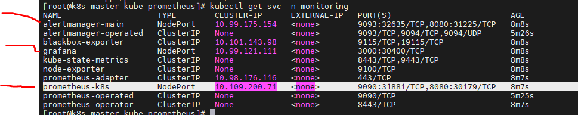

# prometheus

实现企业微信的推送 email， alert 告警

Grafana 可视化界面，也可以集成告警功能

# 部署 prometheus

这包括很多配置文件的介绍，以后要学习

kubectl apply -f prometheus/kube-monitoring.yml
kubectl apply -f prometheus/
kubectl delete -f prometheus/ # 删除
kubectl get all -n kube-monitoring
kubectl get sc
kubectl get svc -n kube-monitoring

登录
prometheus
http://192.168.1.10:30854/

grafana
http://192.168.1.10:30011/
admin
123456
url 配置
http://prometheus.kube-monitoring:9090

# kube-prometheus 这个方案，没有实践成功

kubectl delete -f prometheus/
开始安装
kubectl apply -f manifests/setup/
kubectl create -f manifests/setup/ # 用 create 支持更大资源的创建

kubectl apply -f manifests/

kubectl get all -n monitoring



```
sed -i 's/quay.io/quay.mirrors.ustc.edu.cn/g' prometheusOperator-deployment.yaml
sed -i 's/quay.io/quay.mirrors.ustc.edu.cn/g' prometheus-prometheus.yaml
sed -i 's/quay.io/quay.mirrors.ustc.edu.cn/g' alertmanager-alertmanager.yaml
sed -i 's/quay.io/quay.mirrors.ustc.edu.cn/g' kubeStateMetrics-deployment.yaml
sed -i 's/k8s.gcr.io/lank8s.cn/g' kubeStateMetrics-deployment.yaml
sed -i 's/quay.io/quay.mirrors.ustc.edu.cn/g' nodeExporter-daemonset.yaml
sed -i 's/quay.io/quay.mirrors.ustc.edu.cn/g' prometheusAdapter-deployment.yaml
sed -i 's/k8s.gcr.io/lank8s.cn/g' prometheusAdapter-deployment.yaml

# 查看是否还有国外镜像
grep "image: " * -r


# 卸载

kubectl delete --ignore-not-found=true -f manifests/ -f manifests/setup

```
