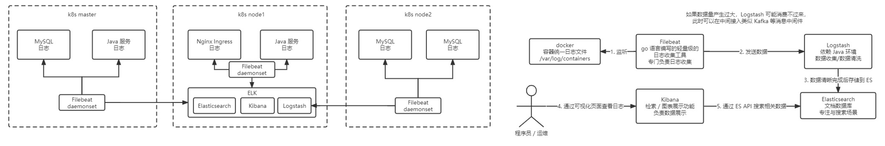
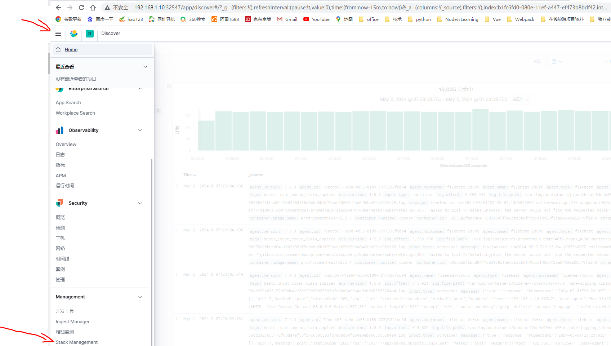
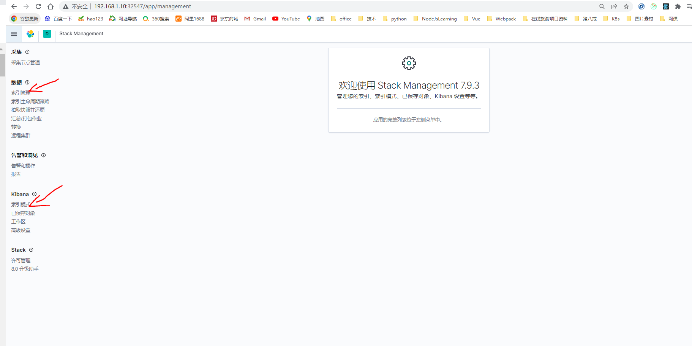

# 介绍

kubectl apply -f es.yaml

kubectl apply -f logstash.yaml
kubectl get po -n kube-logging

kubectl apply -f filebeat.yaml -f kibana.yaml

# kibana 访问

http://192.168.1.10:32547/app/home#/

# 索引管理

# 索引模式

