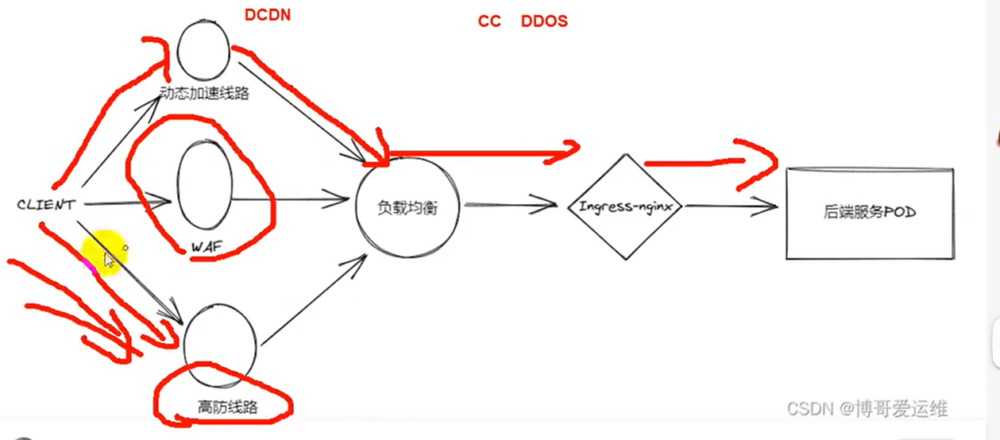

# 介绍

如果我们按下面网络架构图，暴露我们服务到公网上提供访问，那么此时我们后端的业务服务 POD 获取真实 IP 是没什么问题的，但种形式的网络架构直接暴露出我们源站的公网 IP 信息到互联网上，无疑于是在公网上裸奔，一旦遭受攻击，对我们的业务服务将是毁灭性的打击。

那么我们会去寻求一些大型提供公网网络防护的企业的帮助，购买他们的安全服务，如动态加速线路、WAF、或者高防线路，这个时候，我们的业务在公网上提供由于可以相对更安全了，但此时会带来另外一个问题，就是我们后端服务获取的客户端 IP，都是安全服务提供商的代理 IP 了。


# 那么我们怎么解决这个问题，获取到真实 CLIENT 客户端的 IP 地址呢，在 ingress-nginx 控制器上配置其实也不难，加入下面三行配置即可解决：

```
# kubectl -n kube-system edit configmaps nginx-configuration

apiVersion: v1
data:
  ......
  compute-full-forwarded-for: "true"
  forwarded-for-header: "X-Forwarded-For"
  use-forwarded-headers: "true"

```

# 我们来看看这三行配置的详细含义：

```
compute-full-forwarded-for
: 将 remote address 附加到 X-Forwarded-For Header而不是替换它。当启用此选项后端应用程序负责根据自己的受信任代理列表排除并提取客户端 IP。

forwarded-for-header
: 设置用于标识客户端的原始 IP 地址的 Header 字段。默认值X-Forwarded-For
，此处由于A10带入的是自定义记录IP的Header,所以此处填入是X_FORWARDED_FOR

use-forwarded-headers
: 如果设置为True时，则将设定的X-Forwarded-*
 Header传递给后端, 当Ingress在L7 代理/负载均衡器
之后使用此选项。如果设置为 false 时，则会忽略传入的X-Forwarded-*
Header, 当 Ingress 直接暴露在互联网或者 L3/数据包的负载均衡器后面,并且不会更改数据包中的源 IP请使用此选项。

```

# OK，到这里，大家是不是以为万事大吉了，NONONO，这个时候，其实还存在一个安全隐患是我们必须要提前知道的。

我们先来准备部署一个测试服务，用来模拟后端服务 POD，并且能获取 ingress-nginx 传回来的请求头部信息打印出来，以便我们更直观的观察测试的详细情况

```
---
apiVersion: apps/v1
kind: Deployment
metadata:
  name: whoami
  namespace: default
  labels:
    app: whoami
spec:
  replicas: 1
  selector:
    matchLabels:
      app: whoami
  template:
    metadata:
      labels:
        app: whoami
    spec:
      containers:
      - image: traefik/whoami:v1.10
        imagePullPolicy: Always
        name: whoami
        ports:
        - containerPort: 80
          name: 80tcp02
          protocol: TCP
      dnsPolicy: ClusterFirst
      restartPolicy: Always

---
apiVersion: v1
kind: Service
metadata:
  labels:
    app: whoami
  name: whoami
spec:
  ports:
  - port: 80
    protocol: TCP
    targetPort: 80
  selector:
    app: whoami
  sessionAffinity: None
  type: ClusterIP

---

apiVersion: networking.k8s.io/v1
kind: Ingress
metadata:
  annotations:
    nginx.ingress.kubernetes.io/force-ssl-redirect: "false"
    nginx.ingress.kubernetes.io/whitelist-source-range: 192.168.1.20/32  # 只允许信任IP访问，其他返回403，这块IP需要根据实际情况修改
    nginx.ingress.kubernetes.io/configuration-snippet: |  # 加入自定义头部，保存remote_addr信息
      proxy_set_header X-Custom-Real-IP $remote_addr;
  name: whoami
spec:
  rules:
  - host: whoami.boge.com
    http:
      paths:
      - backend:
          service:
            name: whoami
            port:
              number: 80
        path: /
        pathType: ImplementationSpecific
  tls:
  - hosts:
    - whoami.boge.com
    secretName: boge-com-tls

```

上面可以看到，我们对于 whoami 加入了访问限制，只允许出口 IP 为 10.0.1.201 这个地址来访问，其他全部拒绝返回 403

```
curl -H "Host: whoami.boge.com" -s http://10.0.1.201

```

在 201 这台节点上请求是正常的

```
root@node-1:~# curl -H "Host: whoami.boge.com" -s http://10.0.1.201
Hostname: whoami-6cf6989d4c-7hrxz
IP: 127.0.0.1
IP: ::1
IP: 172.20.217.124
IP: fe80::383a:48ff:fe1e:e1e5
RemoteAddr: 172.20.84.128:5110
GET / HTTP/1.1
Host: whoami.boge.com
User-Agent: curl/7.81.0
Accept: */*
X-Custom-Real-Ip: 10.0.1.201
X-Forwarded-For: 10.0.1.201
X-Forwarded-Host: whoami.boge.com
X-Forwarded-Port: 80
X-Forwarded-Proto: http
X-Forwarded-Scheme: http
X-Real-Ip: 10.0.1.201
X-Request-Id: 5b90653f94b45c1fa20ab038ff294534
X-Scheme: http


```

我们来到 202 这台节点请求看看，正常是会返回 403 拒绝请求的

```
root@node-2:~# curl -H "Host: whoami.boge.com" -s http://10.0.1.201
<html>
<head><title>403 Forbidden</title></head>
<body>
<center><h1>403 Forbidden</h1></center>
<hr><center>nginx</center>
</body>
</html>


```

但这个时候，我们在请求头部传入伪造的 XFF 信息，再看结果呢

```
curl -H "X-Forwarded-For: 10.0.1.201" " -H "Host: whoami.boge.com" -s http://10.0.1.201

```

这里我们可以看到我们通过伪造 XFF，成功绕过了服务的安全访问限制。

```
root@node-2:~# curl -H "X-Forwarded-For: 10.0.1.201" -H "boge: test" -H "Host: whoami.boge.com" -s http://10.0.1.201
Hostname: whoami-6cf6989d4c-7hrxz
IP: 127.0.0.1
IP: ::1
IP: 172.20.217.124
IP: fe80::383a:48ff:fe1e:e1e5
RemoteAddr: 172.20.84.128:5110
GET / HTTP/1.1
Host: whoami.boge.com
User-Agent: curl/7.81.0
Accept: */*
Boge: test
X-Custom-Real-Ip: 10.0.1.201
X-Forwarded-For: 10.0.1.201, 10.0.1.202
X-Forwarded-Host: whoami.boge.com
X-Forwarded-Port: 80
X-Forwarded-Proto: http
X-Forwarded-Scheme: http
X-Original-Forwarded-For: 10.0.1.201
X-Real-Ip: 10.0.1.201
X-Request-Id: 81ce680afd34390c7936b72ac0e5c105
X-Scheme: http


```

解决这个也不复杂，就是我们就对请求到 ingress-nginx 控制器的来源 IP 作信任加白处理，只允许信任的 IP 段传来的 XFF 等信息。

但要注意的是，对于提供安全的厂商来说，他们的出口 IP 信息会经常变化的，意味着一旦变化，那么获取客户端真实 IP 又会存在问题。我们在加这个信任配置的时候，需要根据实际情况来作考量要不要添加，其实只要我们不暴露限制的 IP 信息，通常情况下还是相对安全的

```
proxy-real-ip-cidr: 10.0.1.201/32,10.0.1.203/32
```

加了信任 IP 配置后，再请求就没有安全问题了

```
root@node-2:~# curl -H "X-Forwarded-For: 10.0.1.201" -H "boge: test" -H "Host: whoami.boge.com" -s http://10.0.1.201
<html>
<head><title>403 Forbidden</title></head>
<body>
<center><h1>403 Forbidden</h1></center>
<hr><center>nginx</center>
</body>
</html>


```

# 操作

kubectl get cm -n kube-system

kubectl -n kube-system edit configmaps nginx-configuration

```

apiVersion: v1
data:
  ......
  compute-full-forwarded-for: "true"
  forwarded-for-header: "X-Forwarded-For"
  use-forwarded-headers: "true"


```

cd /opt/k8s/ingress/
vim whoami.yaml
kubectl apply -f whoami.yaml

kubectl get po -w
curl -H "Host: whoami.boge.com" -s http://192.168.1.20

```
    Hostname: whoami-6cf6989d4c-lxzg8
    IP: 127.0.0.1
    IP: ::1
    IP: 172.20.139.74
    IP: fe80::4893:efff:fec1:379
    RemoteAddr: 172.20.84.128:12826
    GET / HTTP/1.1
    Host: whoami.boge.com
    User-Agent: curl/7.81.0
    Accept: */*
    X-Custom-Real-Ip: 192.168.1.20
    X-Forwarded-For: 192.168.1.20
    X-Forwarded-Host: whoami.boge.com
    X-Forwarded-Port: 80
    X-Forwarded-Proto: http
    X-Forwarded-Scheme: http
    X-Real-Ip: 192.168.1.20
    X-Request-Id: 32bbb17b0928819bae3fa5546296056b
    X-Scheme: http

```

伪造 xff
curl -H "X-Forwarded-For: 192.168.1.20" -H "Host: whoami.boge.com" -s "http://192.168.1.20"

```

Hostname: whoami-6cf6989d4c-lxzg8
IP: 127.0.0.1
IP: ::1
IP: 172.20.139.74
IP: fe80::4893:efff:fec1:379
RemoteAddr: 172.20.84.128:12826
GET / HTTP/1.1
Host: whoami.boge.com
User-Agent: curl/7.81.0
Accept: */*
X-Custom-Real-Ip: 192.168.1.20
X-Forwarded-For: 192.168.1.20, 192.168.1.21
X-Forwarded-Host: whoami.boge.com
X-Forwarded-Port: 80
X-Forwarded-Proto: http
X-Forwarded-Scheme: http
X-Original-Forwarded-For: 192.168.1.20
X-Real-Ip: 192.168.1.20
X-Request-Id: ca7ba44b65b2e1eaa24a22a5260aac8c
X-Scheme: http

```

kubectl -n kube-system edit configmaps nginx-configuration

```
    proxy-real-ip-cidr: 192.168.1.20/32,192.168.1.22/32

```

再去 21 节点
curl -H "X-Forwarded-For: 192.168.1.20" -H "Host: whoami.boge.com" -s "http://192.168.1.20"
