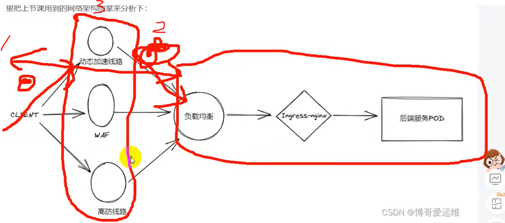

# 介绍

这里我们运维人员首先要对自己业务的整个网络链路非常清楚，这样可以在脑海中快速判断一下有哪些环节的链路可能造成问题，我们这里把上节课用到的网络架构图拿来分析下：


通过向客户索要相应日志的流水号 ID 信息等，这个时候我们是需要在 ingress-nginx 查看日志来定位问题的，那么我们怎么把有问题的这条业务服务请求和 ingress-nginx 日志关联起来呢，就是我们在业务开发的时候，可以和研发部门沟通，将 ingress-nginx 传过来的头部里面 X-Request-Id 这个唯一性标识 ID 记录下来，保存到我们的业务服务日志字段里面，这时候就把两者之间的日志给关联起来了

```

root@node-1:~# curl -H "Host: whoami.boge.com" -s http://10.0.1.201
Hostname: whoami-6cf6989d4c-567vs
IP: 127.0.0.1
IP: ::1
IP: 172.20.139.114
IP: fe80::46b:2dff:fede:1744
RemoteAddr: 172.20.84.128:45544
GET / HTTP/1.1
Host: whoami.boge.com
User-Agent: curl/7.81.0
Accept: */*
X-Custom-Real-Ip: 10.0.1.201
X-Forwarded-For: 10.0.1.201
X-Forwarded-Host: whoami.boge.com
X-Forwarded-Port: 80
X-Forwarded-Proto: http
X-Forwarded-Scheme: http
X-Real-Ip: 10.0.1.201
X-Request-Id: b6f5f63d1e51e25c21640d0223376d68
X-Scheme: http


# 唯一性标识ID：
X-Request-Id: b6f5f63d1e51e25c21640d0223376d68


root@node-1:~# kubectl -n kube-system logs nginx-ingress-controller-m98vx |grep b6f5f63d1e51e25c21640d0223376d68
Defaulted container "nginx-ingress-controller" out of: nginx-ingress-controller, init-sysctl (init)
{"@timestamp": "2023-11-26T16:13:05+08:00","remote_addr": "10.0.1.201","x-forward-for": "10.0.1.201","request_id": "b6f5f63d1e51e25c21640d0223376d68","remote_user": "-","bytes_sent": 611,"request_time": 0.179,"status": 200,"vhost": "whoami.boge.com","request_proto": "HTTP/1.1","path": "/","request_query": "-","request_length": 79,"duration": 0.179,"method": "GET","http_referrer": "-","http_user_agent":  "curl/7.81.0","upstream-sever":"default-whoami-80","proxy_alternative_upstream_name":"","upstream_addr":"172.20.139.114:80","upstream_response_length":469,"upstream_response_time":0.179,"upstream_status":200}


日志里面分析网络请求延迟的关键字段：
"request_time": 0.179,"status": 200   # 客户端发来的请求延迟+我们的服务端响应请求的延迟、请求状态码
"upstream_response_time":0.179,"upstream_status":200   # 我们的服务端响应请求的延迟、请求响应状态码


```

# 操作

curl -H "Host: whoami.boge.com" -s http://192.168.1.20
得到
X-Request-Id: 132c8a6ca0a16cf866e6c1a04ca29180

kubectl -n kube-system logs nginx-ingress-controller-nwckv | grep 132c8a6ca0a16cf866e6c1a04ca29180
主要关注 客户端发起请求，到后端服务响应的总时间
"request_time": 0.002,

后端服务的响应时间，被包含在 request_time 中的，如果延迟很高，可能是后端有问题了，问题是我们的了；如果这个参数正常，但是 request_time 很高，那就得看 链路的前面部分
对接的安全运营商，反馈给他们
"upstream_response_time":0.002,"upstream_status":200

查是客户访问 运营商网络慢 1，还是 运营商访问到负载均衡这慢 2，那就的找网络运营商找原因
