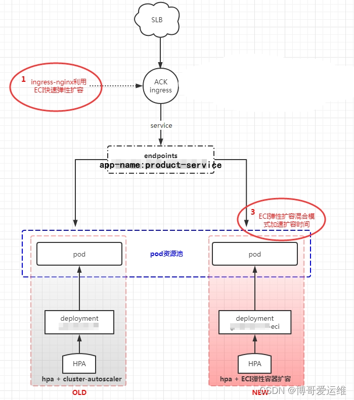

# 下面是全球主流云平台弹性容器相关使用文档

```
aliyun ACK使用ECI :  https://help.aliyun.com/document_detail/119207.html
aws  Fargate :  https://docs.aws.amazon.com/eks/latest/userguide/fargate.html
华为云 cce+cci:  https://support.huaweicloud.com/bestpractice-cce/cce_bestpractice_0133.html
google GKE+Cloud Run:  Cloud Run on a GKE cluster  https://www.cloudskillsboost.google/focuses/5147?locale=zh&parent=catalog
火山云 VKE容器服务 + VCI弹性容器实例   https://www.volcengine.com/docs/6460/76908

```

这里以阿里云的 ACK 托管 K8S 平台+阿里云的 ECI 来聊一聊，其他云平台名称虽然不一样，但底层原理和使用基本差不多。

阿里云弹性容器实例（Elastic Container Instance）是敏捷安全的 Serverless 容器运行服务。您无需管理底层服务器，也无需关心运行过程中的容量规划，只需要提供打包好的 Docker 镜像，即可运行容器，并仅为容器实际运行消耗的资源付费。

弹性容器实例的核心优势主要体现在以下几方面：

# 免运维

采用 Severless 架构，基础设施托管。您无需关心底层服务器，只需要提交容器镜像；无需预先创建集群和维护集群，无需关注运行过程中的容量规划，可以专注业务领域创新。

# 灵活部署

以阿里云全球计算基础设施作为资源池，提供海量、高并发、多种资源类型（CPU、高主频、GPU 等）的容器计算资源，您可以根据需要灵活部署。

# 低成本

按实例启动到结束时间段内消耗的资源计费，时长精确到秒。配合 Kubernetes 或者您自建的调度系统，ECI 可根据业务流量自动弹性伸缩，减少空置费用。
vCPU 单价（vCPU）：0.000049 元/秒
内存单价（GiB）： 0.00000613 元/秒
指定 vCPU 和内存创建一台 2 vCPU、4 GiB 内存的 ECI 实例，则每小时该 ECI 实例的费用为：
vCPU（vCPU）：0.00004936002=0.3528 元
内存（GiB）：0.0000061336004=0.088272 元

# 高弹性

支持快速秒级启动实例，您无需提前预估集群容量和业务流量，可以按需扩容，轻松应对百倍的业务突发流量。

# 兼容性

兼容 Kubernetes，Kubernetes 集群上的 Pod 能直接调度至 ECI。支持无缝集成至阿里云容器服务托管版 Kubernetes（ACK）和 Serverless 版 Kubernetes（ASK），同时支持通过 virtual kubelet 对接您自建的 Kubernetes 集群。

# 集成

自动集成阿里云的其它服务，可快速实现网络访问、日志采集、数据持久化存储、服务监控等功能。例如：日志服务 SLS、文件存储 NAS、监控服务 ARMS 等。

# 使用步骤

ack 集群–组件管理–安装 ACK Virtual Node

完成后，查看虚拟节点

```
kubectl get node|grep virtual

```

然后编辑配置
关注 securityGroupId: sg-gggggggggggggggggggg
安全组需要配置

需要配置
vSwitchIds: vsw-yyyyyyyyyyyyyyyyyy,vsw-xxxxxxxxxxxxxxxxxxx
vpcId: vpc-aaaaaaaaaaaaaaaaaaaaaaaa

```
# kubectl -n kube-system edit configmap eci-profile
apiVersion: v1
data:
  enableClusterIp: "true"
  enableHybridMode: "false"
  enableLogController: "false"
  enablePVCController: "false"
  enablePrivateZone: "false"
  enableReuseSSLKey: "false"
  featureGates: MetricsVpcNet=true,WaitForFirstConsumer=false
  resourceGroupId: ""
  securityGroupId: sg-gggggggggggggggggggg
  selectors: ""
  slsMachineGroup: ""
  vSwitchIds: vsw-yyyyyyyyyyyyyyyyyy,vsw-xxxxxxxxxxxxxxxxxxx
  vpcId: vpc-aaaaaaaaaaaaaaaaaaaaaaaa

```

测试 ECI
加 labels

```
apiVersion: apps/v1
kind: Deployment
metadata:
  labels:
    app: nginx
  name: nginx
spec:
  replicas: 1
  selector:
    matchLabels:
      app: nginx
  template:
    metadata:
      labels:
        alibabacloud.com/eci: "true"   # 在pod这部分添加这个label即代表使用ECI
        app: nginx
    spec:
      containers:
      - image: nginx
        imagePullPolicy: Always
        name: nginx
        ports:
        - containerPort: 80
          name: http80
          protocol: TCP
        resources: {} # 需要配置

```

ECI 混合服务架构



deployment 先创建出来，但是 pod 个数设定为 0，如果有需要，手动改一下个数，应对大流量
