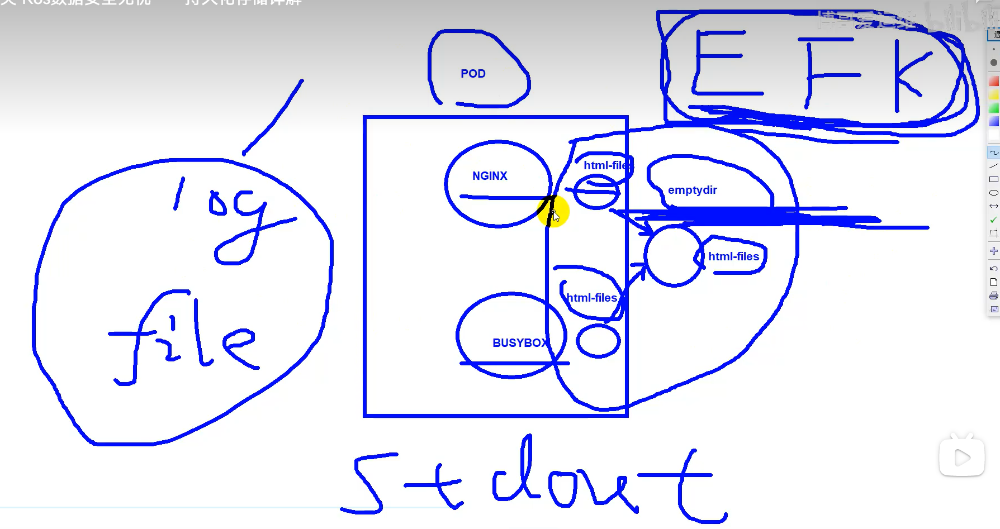

# 介绍

解析 Kubernetes 的持久化存储机制,包括 PV、PVC、StorageClass 等的工作原理、使用场景、最佳实践等,帮您构建稳定可靠的状态存储,确保应用和数据 100% 安全。

# Volume

我们这里先来聊聊 K8s 的存储模型 Volume，来实践下如何将各种持久化的存储映射到 Pod 中的容器。

在我们上面的实战中，大家如果细心的话，会发现把 nginx 服务 pod 内的默认页面改了，但当重启 pod 后，这个页面又恢复成 nginx 容器初始的状态了，所以这里要和大家说的是，在没有配置持久化存储前，任何新增的数据在 pod 发生重启时都是无法保留的，而在 K8s 上，Pod 的生命周期可能是很短，它们会被频繁地销毁和创建，自然在容器销毁时，里面运行时新增的数据，如修改的配置及日志文件等也会被清除。

那么怎么解决这一现象呢，我们可以用 K8s volume 来持久化保存容器的数据，Volume 的生命周期独立于容器，Pod 中的容器可能被销毁重建，但 Volume 会被保留。

emptyDir
hostPath
PersistentVolume(PV) & PersistentVolumeClaim(PVC)
StorageClass

# emptyDir

pod 中的日志收集；目录共享

我们先开始讲讲 emptyDir，它是最基础的 Volume 类型，pod 内的容器发生重启不会造成 emptyDir 里面数据的丢失，但是当 pod 被重启后，emptyDir 数据会丢失，也就是说 emptyDir 与 pod 的生命周期是一致的，那么大家可能有个疑问，这个之前讲的没有配置它也没什么区别呀，实际上在某些时候，它的作用还是挺大的，在生产中它的最实际实用是提供 Pod 内多容器的 volume 数据共享，下面我会用一个实际的生产者，消费者的例子来演示下 emptyDir 的作用，相信大家动动手就会理解得更快了

```
# cat emptyDir.yaml

apiVersion: apps/v1
kind: Deployment
metadata:
  labels:
    app: web
  name: web
  namespace: default
spec:
  replicas: 1
  selector:
    matchLabels:
      app: web
  template:
    metadata:
      labels:
        app: web
    spec:
      containers:
      - image: nginx:1.21.6
        name: nginx
        resources:
          limits:
            cpu: "50m"
            memory: 20Mi
          requests:
            cpu: "50m"
            memory: 20Mi
        volumeMounts:         # 准备将pod的目录进行卷挂载
          - name: html-files  # 自定个名称，容器内可以类似这样挂载多个卷
            mountPath: "/usr/share/nginx/html"

      - name: busybox       # 在pod内再跑一个容器，每秒把当时时间写到nginx默认页面上
        image: registry.cn-shanghai.aliyuncs.com/acs/busybox:v1.29.2
        args:
        - /bin/sh
        - -c
        - >
           while :; do
             if [ -f /html/index.html ];then
               echo "[$(date +%F\ %T)] hello" > /html/index.html
               sleep 1
             else
               touch /html/index.html
             fi
           done
        volumeMounts:
          - name: html-files  # 注意这里的名称和上面nginx容器保持一样，这样才能相互进行访问
            mountPath: "/html"  # 将数据挂载到当前这个容器的这个目录下
      volumes:  # 宿主机会开辟一个 空间?
        - name: html-files   # 最后定义这个卷的名称也保持和上面一样
          emptyDir:          # 这就是使用emptyDir卷类型了
            medium: Memory   # 这里将文件写入内存中保存，这样速度会很快，配置为medium: "" 就是代表默认的使用本地磁盘空间来进行存储
            sizeLimit: 10Mi  # 因为内存比较珍贵，注意限制使用大小

```

更新这个 web 的配置

```
# kubectl apply -f web.yaml
deployment.apps/web configured

# 可以看到READY下面容器数量变为2了
# kubectl get pod
NAME                    READY   STATUS    RESTARTS   AGE
......
web-5bf769fdfc-44p7h    2/2     Running   0          2m4s

# 接着创建一个service来请求测试下
kubectl expose deployment web --port 80 --target-port 80

# kubectl get svc
NAME         TYPE        CLUSTER-IP      EXTERNAL-IP   PORT(S)   AGE
......
web          ClusterIP   10.68.229.231   <none>        80/TCP    4h36m

# 可以看到每次访问都是被写入当前最新时间的页面内容
[root@node-1 ~]# curl 10.68.229.231
[2020-11-27 07:21:34] hello
[root@node-1 ~]# curl 10.68.229.231
[2020-11-27 07:21:35] hello
[root@node-1 ~]# curl 10.68.229.231
[2020-11-27 07:21:36] hello
[root@node-1 ~]# curl 10.68.229.231
[2020-11-27 07:21:38] hello


```

我们来探究下原理

```
# 下面这个是docker容器运行时的记录
# 看下这个web的pod的描述信息
# kubectl describe pod web-5bf769fdfc-44p7h
......
Node:         10.0.1.203/10.0.1.203     # 找到这个pod运行在哪个node上
......
Containers:
  nginx:
    Container ID:   docker://c1482a15f756ff3bc089973ec942a4e60f7ec34674ab8435a47a94d4b93411a7   # 找到pod内nginx容器的ID
......
  busybox:
    Container ID:  docker://ecedf3b0ffa6b5101e84a21f8dbf6188179875b5db61980bc93b65195f558c6f   # 找到pod内busybox容器的ID


# 我们登陆10.0.1.203 这台node，查看pod内这两个容器的volume挂载信息，我们发现两个容器都 mount 了同一个目录
[root@node-3 ~]# docker inspect c1482a15f756ff3bc089973ec942a4e60f7ec34674ab8435a47a94d4b93411a7|grep volume|grep html
                "/var/lib/container/kubelet/pods/cc4832f3-c73c-479f-9088-12b079ff4608/volumes/kubernetes.io~empty-dir/html-files:/usr/share/nginx/html",
                "Source": "/var/lib/container/kubelet/pods/cc4832f3-c73c-479f-9088-12b079ff4608/volumes/kubernetes.io~empty-dir/html-files",


[root@node-3 ~]# docker inspect ecedf3b0ffa6b5101e84a21f8dbf6188179875b5db61980bc93b65195f558c6f|grep volume|grep html
                "/var/lib/container/kubelet/pods/cc4832f3-c73c-479f-9088-12b079ff4608/volumes/kubernetes.io~empty-dir/html-files:/html",
                "Source": "/var/lib/container/kubelet/pods/cc4832f3-c73c-479f-9088-12b079ff4608/volumes/kubernetes.io~empty-dir/html-files",


# Containerd运行时日志目录：
# ll /var/log/containers/|grep web

```

# hostPath

hostPath Volume 的作用是将容器运行的 node 上已经存在文件系统目录给 mount 到 pod 的容器。在生产中大部分应用是是不会直接使用 hostPath 的，因为我们并不关心 Pod 在哪台 node 上运行，而 hostPath 又恰好增加了 pod 与 node 的耦合，限制了 pod 的使用，这里我们只作一下了解，知道有这个东西存在即可，一般只是一些安装服务会用到，比如下面我截取了网络插件 calico 的部分 volume 配置:

```

    volumeMounts:
    - mountPath: /host/driver
      name: flexvol-driver-host
......
  volumes:
......
  - hostPath:
      path: /usr/libexec/kubernetes/kubelet-plugins/volume/exec/nodeagent~uds
      type: DirectoryOrCreate
    name: flexvol-driver-host


```

# 操作

kuectl apply -f emptyDir.yaml

curl 172.20.139.94 # pod 的 IP

kubectl exec -it web-68b49c5b9-xwf4k -c nginx -- bash
cd /usr/share/nginx/html
cat index.html
df -Th # 查看磁盘的挂载，临时目录上去了

进入到 busybox 容器中
kubectl exec -it web-68b49c5b9-xwf4k -c busybox -- sh
df -Th
tmpfs tmpfs 10.0M 4.0K 10.0M 0% /html # 有这个结果
ls -l /html/
cd /html
cat index.html



emptyDir 的 pod 被分配到的 节点 22 上去,进入 22 节点
ssh 192.168.1.22

ll /var/log/containers/ # 当前节点 运行的所有 pod 的 log 目录
ll /var/log/containers/ | grep web # web-68b49c5b9-xwf4k pod 名字一部分作为关键词

container Id 跟 log 文件名字，有一个关联性，可以参考图片
 

cat /var/log/pods/default_web-68b49c5b9-xwf4k_ca02c923-1bc4-4c97-ae9a-6b619aaac900/nginx/0.log
这里有标准输出日志 stdout # EFK 的一套中，能获取道的是这个标准输出内容
