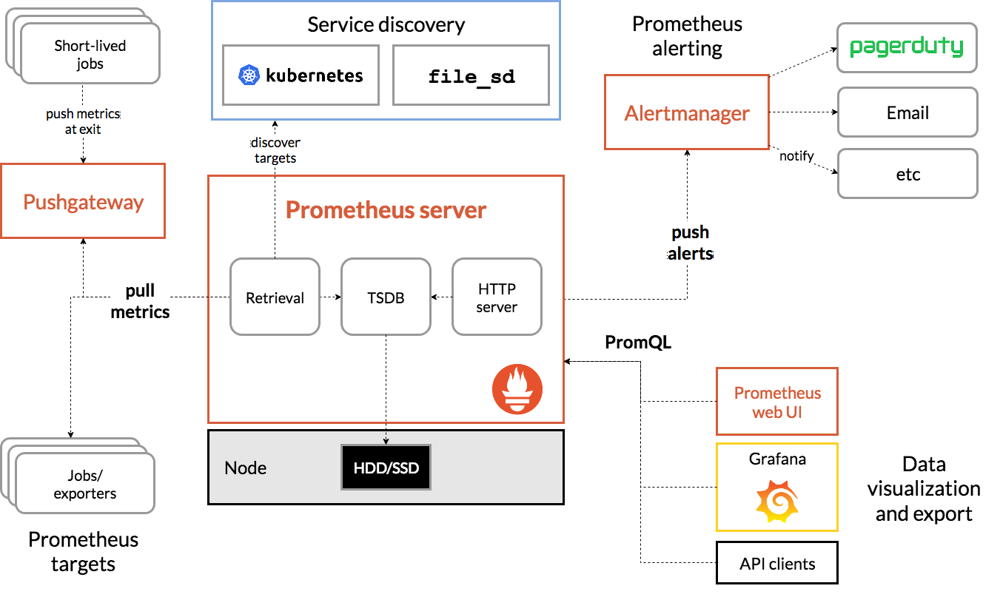

# 介绍

Prometheus 是由 golang 语言编写，这样它的部署实际上是比较简单的，就一个服务的二进制包加上对应的配置文件即可运行，然而这种方式的部署过程繁琐并且效率低下，我们这里就不以这种传统的形式来部署 Prometheus 来实现 K8s 集群的监控了，而是会用到 Prometheus-Operator 来进行 Prometheus 监控服务的安装，这也是我们生产中常用的安装方式。

从本质上来讲 Prometheus 属于是典型的有状态应用，而其有包含了一些自身特有的运维管理和配置管理方式。而这些都无法通过 Kubernetes 原生提供的应用管理概念实现自动化。为了简化这类应用程序的管理复杂度，CoreOS 率先引入了 Operator 的概念，并且首先推出了针对在 Kubernetes 下运行和管理 Etcd 的 Etcd Operator。并随后推出了 Prometheus Operator。

# Prometheus Operator 的工作原理

从概念上来讲 Operator 就是针对管理特定应用程序的，在 Kubernetes 基本的 Resource 和 Controller 的概念上，以扩展 Kubernetes api 的形式。帮助用户创建，配置和管理复杂的有状态应用程序。从而实现特定应用程序的常见操作以及运维自动化。

在 Kubernetes 中我们使用 Deployment、DamenSet，StatefulSet 来管理应用 Workload，使用 Service，Ingress 来管理应用的访问方式，使用 ConfigMap 和 Secret 来管理应用配置。我们在集群中对这些资源的创建，更新，删除的动作都会被转换为事件(Event)，Kubernetes 的 Controller Manager 负责监听这些事件并触发相应的任务来满足用户的期望。这种方式我们成为声明式，用户只需要关心应用程序的最终状态，其它的都通过 Kubernetes 来帮助我们完成，通过这种方式可以大大简化应用的配置管理复杂度。

而除了这些原生的 Resource 资源以外，Kubernetes 还允许用户添加自己的自定义资源(Custom Resource)。并且通过实现自定义 Controller 来实现对 Kubernetes 的扩展。

如下所示，是 Prometheus Operator 的架构示意图：

# Prometheus Operator 能做什么

要了解 Prometheus Operator 能做什么，其实就是要了解 Prometheus Operator 为我们提供了哪些自定义的 Kubernetes 资源，列出了 Prometheus Operator 目前提供的️ 4 类资源：

Prometheus：声明式创建和管理 Prometheus Server 实例；
ServiceMonitor：负责声明式的管理监控配置；
PrometheusRule：负责声明式的管理告警配置；
Alertmanager：声明式的创建和管理 Alertmanager 实例。
简言之，Prometheus Operator 能够帮助用户自动化的创建以及管理 Prometheus Server 以及其相应的配置。
