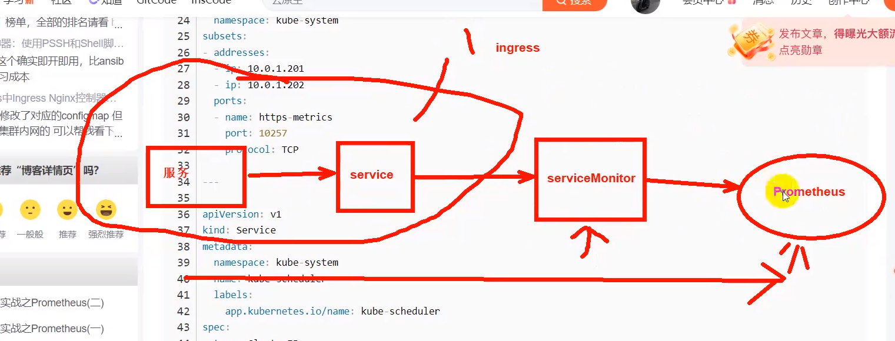

#

访问 prometheus 后台，点击上方菜单栏 Status — Targets ，我们发现 kube-controller-manager 和 kube-scheduler 未发现

接下来我们解决下这一个碰到的问题吧

```
# 这里我们发现这两服务监听的IP是0.0.0.0 正常
# ss -tlnp|egrep 'controller|schedule'
LISTEN 0      32768              *:10257            *:*    users:(("kube-controller",pid=3528,fd=3))
LISTEN 0      32768              *:10259            *:*    users:(("kube-scheduler",pid=837,fd=3))

root@node-1:~# ip r
default via 192.168.1.1 dev ens32 proto static
172.17.0.0/16 dev docker0 proto kernel scope link src 172.17.0.1
172.18.0.0/16 dev br-5443e947831d proto kernel scope link src 172.18.0.1
blackhole 172.20.84.128/26 proto bird
172.20.84.185 dev cali32d4c42caf9 scope link
172.20.84.186 dev cali1212408c5c1 scope link
172.20.139.64/26 via 192.168.1.22 dev tunl0 proto bird onlink
172.20.217.64/26 via 192.168.1.23 dev tunl0 proto bird onlink
172.20.247.0/26 via 192.168.1.21 dev tunl0 proto bird onlink
192.168.1.0/24 dev ens32 proto kernel scope link src 192.168.1.20   #


```

curl 192.168.1.20:10257/metrics
Client sent an HTTP request to an HTTPS server.

curl http://192.168.1.20:10257/metrics
Client sent an HTTP request to an HTTPS server.

curl https://192.168.1.20:10257/metrics
curl -k https://192.168.1.20:10257/metrics # -k 忽略问题

```
# 证明访问没有问题，只是因为证书问题 被拒绝
{
  "kind": "Status",
  "apiVersion": "v1",
  "metadata": {},
  "status": "Failure",
  "message": "forbidden: User \"system:anonymous\" cannot get path \"/metrics\"",
  "reason": "Forbidden",
  "details": {},
  "code": 403
}r

```

systemctl status kube-controller-manager.service

```
Loaded: loaded (/etc/systemd/system/kube-controller-manager.service; enabled; vendor preset: enabled)

 cat /etc/systemd/system/kube-controller-manager.service
[Unit]
Description=Kubernetes Controller Manager
Documentation=https://github.com/GoogleCloudPlatform/kubernetes

[Service]
ExecStart=/opt/kube/bin/kube-controller-manager \
  --allocate-node-cidrs=true \
  --authentication-kubeconfig=/etc/kubernetes/kube-controller-manager.kubeconfig \
  --authorization-kubeconfig=/etc/kubernetes/kube-controller-manager.kubeconfig \
  --bind-address=0.0.0.0 \
  --cluster-cidr=172.20.0.0/16 \
  --cluster-name=kubernetes \
  --cluster-signing-cert-file=/etc/kubernetes/ssl/ca.pem \  # 关注这
  --cluster-signing-key-file=/etc/kubernetes/ssl/ca-key.pem \
  --kubeconfig=/etc/kubernetes/kube-controller-manager.kubeconfig \
  --leader-elect=true \
  --node-cidr-mask-size=24 \
  --root-ca-file=/etc/kubernetes/ssl/ca.pem \
  --service-account-private-key-file=/etc/kubernetes/ssl/ca-key.pem \
  --service-cluster-ip-range=10.68.0.0/16 \
  --use-service-account-credentials=true \
  --v=2
Restart=always
RestartSec=5

[Install]
WantedBy=multi-user.target
```

然后因为 K8s 的这两上核心组件我们是以二进制形式部署的，为了能让 K8s 上的 prometheus 能发现，我们需要来创建相应的 service 和 endpoints 来将其关联起来
kubectl -n monitoring get servicemonitors.monitoring.coreos.

```
NAME                      AGE
alertmanager-main         24h
blackbox-exporter         24h
coredns                   24h
grafana                   24h
kube-apiserver            24h
kube-controller-manager   24h
kube-scheduler            24h
kube-state-metrics        24h
kubelet                   24h
node-exporter             24h
prometheus-adapter        24h
prometheus-k8s            24h
prometheus-operator       24h

```

```
注意：我们需要将endpoints里面的NODE IP换成我们实际情况的

apiVersion: v1
kind: Service
metadata:
  namespace: kube-system
  name: kube-controller-manager
  labels:
    app.kubernetes.io/name: kube-controller-manager
spec:
  type: ClusterIP
  clusterIP: None
  ports:
  - name: https-metrics
    port: 10257
    targetPort: 10257
    protocol: TCP

---
apiVersion: v1
kind: Endpoints
metadata:
  labels:
    app.kubernetes.io/name: kube-controller-manager
  name: kube-controller-manager
  namespace: kube-system
subsets:
- addresses:
  - ip: 192.168.1.20
  - ip: 192.168.1.21
  ports:
  - name: https-metrics
    port: 10257
    protocol: TCP

---

apiVersion: v1
kind: Service
metadata:
  namespace: kube-system
  name: kube-scheduler
  labels:
    app.kubernetes.io/name: kube-scheduler
spec:
  type: ClusterIP
  clusterIP: None
  ports:
  - name: https-metrics
    port: 10259
    targetPort: 10259
    protocol: TCP

---
apiVersion: v1
kind: Endpoints
metadata:
  labels:
    app.kubernetes.io/name: kube-scheduler
  name: kube-scheduler
  namespace: kube-system
subsets:
- addresses:
  - ip: 192.168.1.20
  - ip: 192.168.1.21
  ports:
  - name: https-metrics
    port: 10259
    protocol: TCP


```



```
root@node-1:/opt/k8s/Prometheus# kubectl -n monitoring apply -f repair.yaml
the namespace from the provided object "kube-system" does not match the namespace "monitoring". You must pass '--namespace=kube-system' to perform this operation.
the namespace from the provided object "kube-system" does not match the namespace "monitoring". You must pass '--namespace=kube-system' to perform this operation.
the namespace from the provided object "kube-system" does not match the namespace "monitoring". You must pass '--namespace=kube-system' to perform this operation.
the namespace from the provided object "kube-system" does not match the namespace "monitoring". You must pass '--namespace=kube-system' to perform this operation.

```

kubectl -n kube-system apply -f repair.yaml

# 然后去 Prometheus UI 查看， kube-controller-manager 和 kube-scheduler 是否被监控

# 对于托管的集群，我们不用关心 kube-apiserver 和 kube-controller-manager，对于我们是黑盒的，报警可以屏蔽
