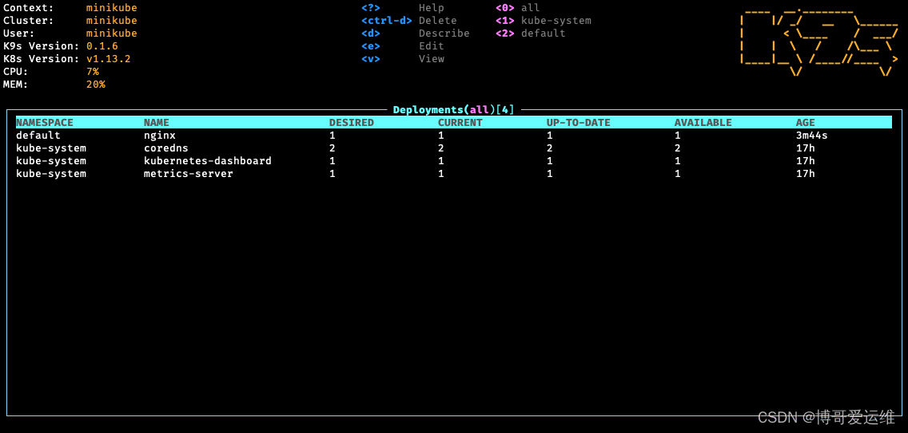
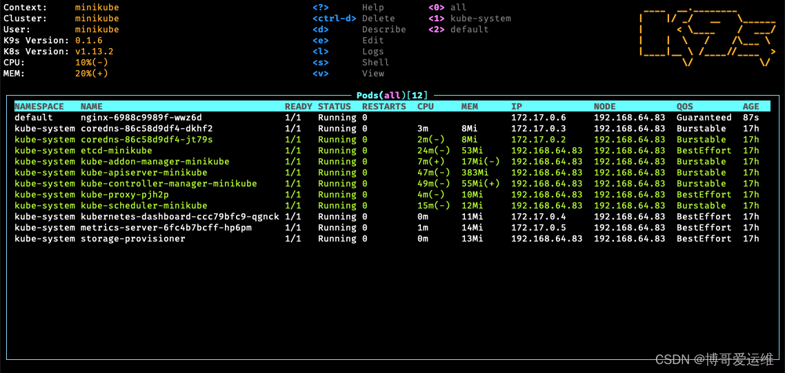
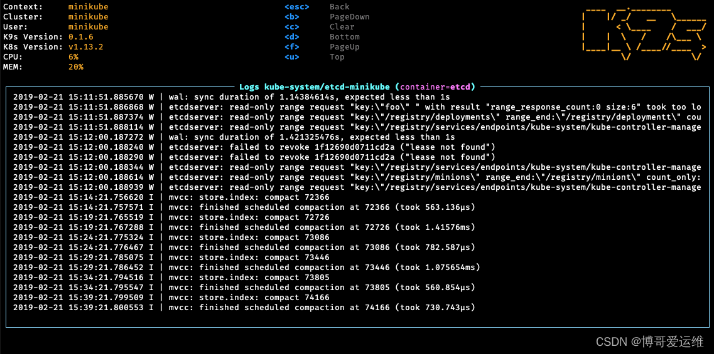

# 介绍

随着我们管理维护的 K8S 集群上线，怎么管理好集群上面成百上千的服务 pod，就是我们该操心的事情了。这里博哥把在生产中一直在用的一个开源管理工具 k8s，github 23.7k stars，推荐给大家。
github 地址：https://github.com/derailed/k9s

k9s 相较于同类一些 K8S 管理工具更轻量化，但功能却都很实用，它是一个用来监控整个 K8s 上运行 pod 资源的命令行工具，它的整个界面有点类似于 htop，能够非常实时地监控 k8s 上所有资源的运行情况，它是开源的，因为是用 go 语言编写，所以使用上面来说也是非常的简单容易上手的

下载完成后，将 k8s 二进制文件放到 bin 目录下，并赋予可执行权限，直接输入 k9s 就可以运行了，用 k9s 来实时监控 pod 的运行是非常 NICE 的。

shift + :
输入 ns 回车，选择 namespace，选择的 ns 会加入到顶上快捷列表
输入 pod 回车，进入 pod 模式，也是最常用的模式

# 查看 deployment 资源

# 查看 pods 资源

# 监听 pod 日志

# 操作

cd /opt/k8s/k9s/

tar xf k9s_Linux_amd64.tar.gz
mv k9s /usr/bin/
k9s
shift + : 输入 ns # 会出现所有命名空间
control + c # 推出

l # 查看 pod 日志
w # 日志换行输出
s # Autoscroll:Off 刷不刷

esc

s # 进入到 pod 中
exit
control + d # 重启 pod
