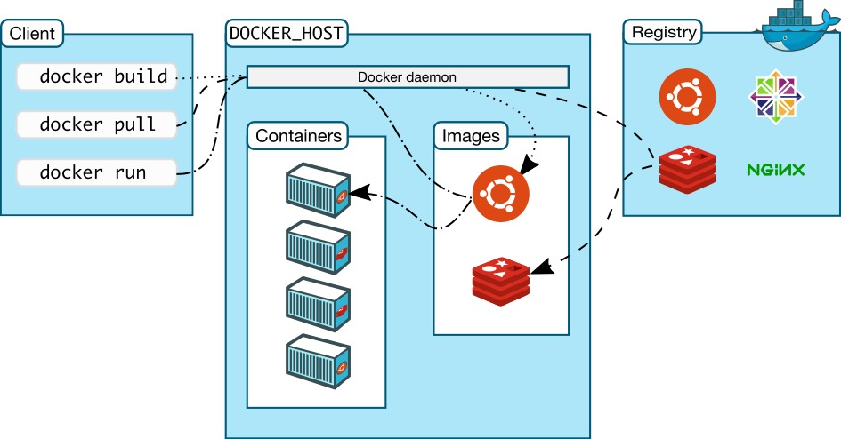

# 介绍

部署 dind(docker in docker)
大家好，我是博哥爱运维。我们现在在 k8s 来部署 dind 服务，提供整个 CI（持续集成）的功能。

我们看看 docker version 列出的结果 Docker 采取的是 C/S 架构 Docker 进程默认不监听任何端口，它会生成一个 socket（/var/run/docker.sock）文件来进行本地进程通信 Docker C/S 之间采取 Rest API 作为通信协议，我们可以让 Docker daemon 进程监听一个端口，这就为我们用 docker client 调用远程调用 docker daemon 进程执行镜像构建提供了可行性


# docker in docker

```
# 资源不够用时候，kubectl describe pod 会提示这个信息
# dind pip instll staus : kill -9  code 137(128+9) ,may be limits(cpu,memory) resources need change

# only have docker client ,use dind can be use normal
#dindSvc=$(kubectl -n kube-system get svc dind |awk 'NR==2{print $3}')
#export DOCKER_HOST="tcp://${dindSvc}:2375/"
#export DOCKER_DRIVER=overlay2
#export DOCKER_TLS_CERTDIR="" # 关闭证书，没有这个，会报错，需要提供证书设置


---
# SVC
kind: Service
apiVersion: v1
metadata:
  name: dind
  namespace: kube-system
spec:
  selector:
    app: dind
  ports:
    - name: tcp-port
      port: 2375
      protocol: TCP
      targetPort: 2375

---
# Deployment
apiVersion: apps/v1
kind: Deployment
metadata:
  name: dind
  namespace: kube-system
  labels:
    app: dind
spec:
  replicas: 1
  selector:
    matchLabels:
      app: dind
  template:
    metadata:
      labels:
        app: dind
    spec:
      hostNetwork: true # 容器端口映射到宿主机上
      containers:
      - name: dind
        image: docker:19-dind
        #image: harbor.boge.com/library/docker:19-dind
        lifecycle:
          postStart: # 运行之前，登录私有仓库，就可以拉取私有仓库镜像了，为后面打包准备
            exec:
              command: ["/bin/sh", "-c", "docker login harbor.boge.com -u 'boge' -p 'Boge@666'"]
           # 3. when delete this pod , use this keep kube-proxy to flush role done
          preStop: # 提供缓冲
            exec:
              command: ["/bin/sh", "-c", "sleep 5"]
        ports:
        - containerPort: 2375
#        resources:
#          requests:
#            cpu: 200m
#            memory: 256Mi
#          limits:
#            cpu: 0.5
#            memory: 1Gi
        readinessProbe:
          tcpSocket:
            port: 2375
          initialDelaySeconds: 10
          periodSeconds: 30
        livenessProbe:
          tcpSocket:
            port: 2375
          initialDelaySeconds: 10
          periodSeconds: 30
        securityContext: # 需要特权
            privileged: true
        env:
          - name: DOCKER_HOST
            value: tcp://localhost:2375
          - name: DOCKER_DRIVER
            value: overlay2
          - name: DOCKER_TLS_CERTDIR
            value: ''
        volumeMounts:
          - name: docker-graph-storage
            mountPath: /var/lib/docker
          - name: tz-config
            mountPath: /etc/localtime
           # kubectl -n kube-system create secret generic harbor-ca --from-file=harbor-ca=/data/harbor/ssl/tls.cert  # /opt/k8s/harbor/tls/boge.com.cert
          - name: harbor-ca
            mountPath: /etc/docker/certs.d/harbor.boge.com/ca.crt
            subPath: harbor-ca
       # kubectl -n kube-system create secret docker-registry bogeharbor --docker-server=harbor.boge.com --docker-username=boge --docker-password=Boge@666 --docker-email=admin@boge.com
      hostAliases:
      - hostnames:
        - harbor.boge.com
        ip: 192.168.1.20
      imagePullSecrets:
      - name: bogeharbor
      volumes:
#      - emptyDir:
#          medium: ""
#          sizeLimit: 10Gi
      - hostPath:
          path: /var/lib/container/docker
        name: docker-graph-storage
      - hostPath:
          path: /usr/share/zoneinfo/Asia/Shanghai
        name: tz-config
      - name: harbor-ca
        secret:
          secretName: harbor-ca
          defaultMode: 0600
#
#        kubectl taint node 192.168.1.20 Ingress=:NoExecute
#        kubectl describe node 192.168.1.20 |grep -i taint
#        kubectl taint node 192.168.1.20 Ingress:NoExecute-
      nodeSelector:
        kubernetes.io/hostname: "192.168.1.20"
      tolerations:
      - operator: Exists

```

kubectl exec -it dind-f68d78bb7-nfdvj -n kube-system sh

docker pull harbor.boge.com/product/alertmanaer-webhook:1.0
